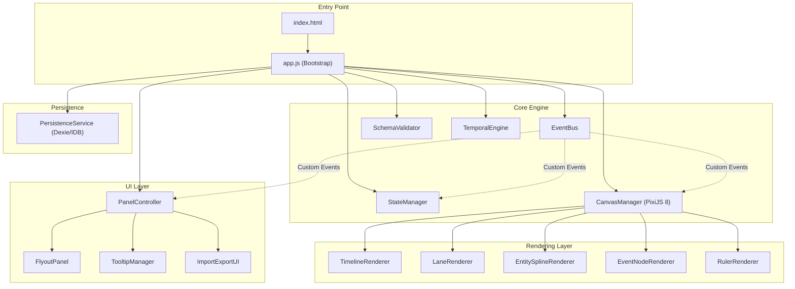

# The Great Tale Timeline — Implementation Plan

> A high-performance, data-driven chronological engine for visualizing complex historical narratives across vast scales.

## Resolved Decisions

- ✅ **Rendering Library:** PixiJS 8 confirmed.
- ✅ **IndexedDB Wrapper:** Dexie.js confirmed.
- ✅ **Scope:** All 5 phases — full implementation.
- ✅ **Sample Data:** I will create a Tolkien/Arda sample dataset.
- ✅ **Deployment:** Local dev server, targeting GitHub Pages for eventual hosting.
- ✅ **"Great Void" Prologue:** Toggleable option in the display settings flyout (not always-on).
- ✅ **Data Loading:** App loads blank by default (final). During development, auto-loads the sample Tolkien data file.

---

## Architecture Overview



### CDN Dependencies

| Library | Version | CDN URL | Purpose |
|---------|---------|---------|---------|
| PixiJS | 8.18.1 | `cdn.jsdelivr.net/npm/pixi.js@8.18.1/dist/pixi.min.mjs` | Canvas rendering engine |
| GSAP | 3.15.0 | `cdn.jsdelivr.net/npm/gsap@3.15.0/+esm` | Smooth zoom/pan animations |
| Dexie.js | 4.x | `cdn.jsdelivr.net/npm/dexie@4/dist/dexie.mjs` | IndexedDB wrapper |
| Lucide | 0.400.0 | `unpkg.com/lucide@0.400.0` | UI icons |
| Google Fonts | — | `fonts.googleapis.com` | Inter + Cinzel (scholar aesthetic) |

---

## Proposed Changes

### Phase 1 — Foundation & Scrollable Timeline

> **Goal:** Bootable app with a zoomable, pannable canvas showing epoch regions and a time ruler.

---

#### [NEW] [index.html](file:///c:/Users/dvidi/Documents/Progamming/The%20Great%20Tale%20Timeline/index.html)

The single HTML entry point. Loads CDN scripts, mounts the PixiJS canvas, and the DOM overlay panels.

- `<link>` tags for Google Fonts (Inter, Cinzel Decorative)
- `<link>` tag for Lucide icons
- `<div id="app-root">` containing:
  - `<div id="ruler-strip">` — sticky top ruler(s)
  - `<canvas id="timeline-canvas">` — PixiJS mount point
  - `<div id="flyout-panel">` — right-side filter panel
  - `<div id="tooltip-container">` — glassmorphism tooltip overlay
- `<script type="module" src="./js/app.js">`

---

#### [NEW] [css/main.css](file:///c:/Users/dvidi/Documents/Progamming/The%20Great%20Tale%20Timeline/css/main.css)

Complete design system implementing the "Scholar's Palette" aesthetic.

- CSS custom properties for the full color system (`--slate-bg: #1a1b26`, parchment text, race colors)
- Typography scale using Inter (body) and Cinzel Decorative (headings/epoch labels)
- Glassmorphism utility classes (backdrop-filter, frosted borders)
- Responsive layout rules (flex/grid, min-width 320px)
- Ruler strip styling (sticky, layered z-index)
- Flyout panel styling (slide-in animation, nested checkbox tree)
- Tooltip card styling (glassmorphism, fade-in micro-animation)
- Scrollbar theming for dark mode
- CSS keyframe animations for "mist" / temporal fuzziness gradients

---

#### [NEW] [js/app.js](file:///c:/Users/dvidi/Documents/Progamming/The%20Great%20Tale%20Timeline/js/app.js)

Application bootstrap module. Orchestrates initialization order.

- Instantiates `EventBus`, `StateManager`, `TemporalEngine`
- Initializes PixiJS `Application` via `await app.init()`
- Loads default world config + sample data (or prompts for import)
- Validates data through `SchemaValidator`
- Hands off to `CanvasManager` for first render
- Sets up resize observer for responsive canvas

---

#### [NEW] [js/core/EventBus.js](file:///c:/Users/dvidi/Documents/Progamming/The%20Great%20Tale%20Timeline/js/core/EventBus.js)

Pub/sub event system decoupling all modules.

- `on(eventName, handler)` — subscribe
- `off(eventName, handler)` — unsubscribe (named function cleanup)
- `emit(eventName, payload)` — broadcast
- Event constants exported: `ZOOM_CHANGED`, `PAN_CHANGED`, `FILTER_CHANGED`, `DATA_LOADED`, `EPOCH_SELECTED`, `TOOLTIP_SHOW`, `TOOLTIP_HIDE`, `MODE_SWITCHED`

---

#### [NEW] [js/core/StateManager.js](file:///c:/Users/dvidi/Documents/Progamming/The%20Great%20Tale%20Timeline/js/core/StateManager.js)

Global state singleton managing the application's reactive state.

- Holds: `currentZoom`, `panOffset`, `activeFilters`, `visibleEpochs`, `viewMode` (geographic | biographical), `activeTimeSystems`, `selectedEvent`
- Proxy-based reactivity — mutations automatically emit events via `EventBus`
- Computed getters for derived state (e.g., `visibleTimeRange`, `pixelsPerYear`)

---

#### [NEW] [js/core/TemporalEngine.js](file:///c:/Users/dvidi/Documents/Progamming/The%20Great%20Tale%20Timeline/js/core/TemporalEngine.js)

The mathematical heart — translates between dating systems and pixel coordinates.

- `masterScaleToPixel(tu, zoom, panOffset)` → x-coordinate
- `pixelToMasterScale(x, zoom, panOffset)` → tu value
- `convertToSystem(tu, systemId)` → display value (e.g., "V.Y. 1495")
- `formatDateLabel(tu, systemId, zoom)` → human-readable string with adaptive granularity
- Handles Valian↔Solar conversion (1 VY = 9.582 Solar Years)
- Manages epoch boundary lookups
- Uses `Number` with high precision (not BigInt) — the spec mentions BigInt as an option, but the maximum range (~34,000 solar years) fits comfortably in a 64-bit float with sub-year precision

---

#### [NEW] [js/canvas/CanvasManager.js](file:///c:/Users/dvidi/Documents/Progamming/The%20Great%20Tale%20Timeline/js/canvas/CanvasManager.js)

PixiJS lifecycle controller. Owns the render loop and layer ordering.

- Creates and manages the PixiJS `Application` instance
- Manages render layers as `Container` children (back-to-front):
  1. `epochBackgroundLayer` — colored epoch regions
  2. `laneLayer` — geographic lane bands
  3. `splineLayer` — entity migration/lifespan lines
  4. `eventLayer` — event nodes and clusters
  5. `uiOverlayLayer` — selection highlights, crosshairs
- Implements zoom (mouse wheel + pinch) via GSAP-smoothed scaling
- Implements pan (click-drag) with momentum/inertia
- Calls `requestAnimationFrame` loop with dirty-flag optimization (only re-render on state change)
- Manages Level-of-Detail (LoD) thresholds for clustering

---

#### [NEW] [js/canvas/RulerRenderer.js](file:///c:/Users/dvidi/Documents/Progamming/The%20Great%20Tale%20Timeline/js/canvas/RulerRenderer.js)

Renders the "Elastic Ruler" sticky header(s) as DOM elements (not on canvas, for crisp text).

- Generates tick marks at adaptive intervals based on zoom level
- Supports stacked rulers (Solar + Valian simultaneously)
- Epoch labels as colored segments
- Smooth tick interpolation on zoom via GSAP

---

### Phase 2 — Data Layer & Event Rendering

> **Goal:** Load world config + event data, render events as interactive nodes on the timeline.

---

#### [NEW] [js/core/SchemaValidator.js](file:///c:/Users/dvidi/Documents/Progamming/The%20Great%20Tale%20Timeline/js/core/SchemaValidator.js)

Validates and sanitizes all incoming JSON data.

- Validates against the 4 schemas (World Config, Events, Entities, Lanes) defined in the spec
- Type checking, required field enforcement, range validation
- HTML/XSS sanitization of all string fields (event descriptions, entity names)
- Returns structured error reports with line-level detail

---

#### [NEW] [js/canvas/EventNodeRenderer.js](file:///c:/Users/dvidi/Documents/Progamming/The%20Great%20Tale%20Timeline/js/canvas/EventNodeRenderer.js)

Renders individual events as visual nodes on the canvas.

- Maps events to x-position via `TemporalEngine`
- Maps events to y-position via lane assignment
- Renders different shapes by event `type` (circle for point events, bar for ranges)
- **Temporal Fuzziness:** Events with `is_approximate: true` get a gradient "mist" effect (PixiJS blur filter + alpha gradient)
- Importance-based sizing (importance 1–10 maps to node radius)
- Click handler → emits `TOOLTIP_SHOW` with event data
- Hover handler → subtle glow animation via GSAP

---

#### [NEW] [js/canvas/LaneRenderer.js](file:///c:/Users/dvidi/Documents/Progamming/The%20Great%20Tale%20Timeline/js/canvas/LaneRenderer.js)

Renders the Y-axis geographic lanes as horizontal bands.

- Draws colored bands per lane using `color_hint` from the Lane Schema
- Lane labels rendered as sticky left-edge text
- Handles "Geographic Erasure" — lanes with an `end_tu` fade out with a torn-edge visual effect
- Lane visibility toggled via `EventBus` filter events

---

#### [NEW] [js/data/DataStore.js](file:///c:/Users/dvidi/Documents/Progamming/The%20Great%20Tale%20Timeline/js/data/DataStore.js)

In-memory data manager. Holds the parsed, validated data and provides query APIs.

- `getEventsInRange(startTu, endTu)` — spatial query for visible viewport
- `getEventsByLane(laneId)` — filter by geographic lane
- `getEntitiesByRace(race)` — filter by metadata
- `getEventsByImportance(minImportance)` — importance threshold
- Maintains sorted indices for fast binary-search lookups
- Receives data from `PersistenceService` or direct JSON import

---

### Phase 3 — Entity Splines & Biographical Mode

> **Goal:** Render character migration paths as animated Bézier splines. Enable the dual-axis "Biographical Stack" mode.

---

#### [NEW] [js/canvas/EntitySplineRenderer.js](file:///c:/Users/dvidi/Documents/Progamming/The%20Great%20Tale%20Timeline/js/canvas/EntitySplineRenderer.js)

Renders entity lifespans as flowing spline paths across lanes.

- For each entity, gathers their chronological events sorted by `start` time
- Computes Catmull-Rom → Cubic Bézier control points between consecutive lane positions
- Renders via PixiJS `Graphics.bezierCurveTo()` chains
- Color-coded by entity `metadata.color`
- "Immortal Persistence" — entities with no death/departure extend to the right edge
- **Spline Dynamics:** At high zoom, adds animated directional arrows (PixiJS sprite particles along the path, GSAP-animated)
- Handles "Geographic Erasure" gracefully — splines passing through a destroyed lane use a dashed/faded segment

---

#### [NEW] [js/canvas/BiographicalRenderer.js](file:///c:/Users/dvidi/Documents/Progamming/The%20Great%20Tale%20Timeline/js/canvas/BiographicalRenderer.js)

Alternative Y-axis mode — Gantt-chart-style lifespan comparison.

- Switches Y-axis from lanes to entities
- Each entity gets a horizontal row
- Lifespan rendered as a colored bar (start → death/departure)
- Key events rendered as markers along the bar
- Enables side-by-side comparison (User Story 2: Kings of Númenor vs Gondor)
- Sorting options: by birth date, by race, by duration, alphabetical

---

### Phase 4 — UI Panels, Tooltips & Filtering

> **Goal:** Full interactive UI — flyout filter panel, glassmorphism tooltips, data import/export.

---

#### [NEW] [js/ui/PanelController.js](file:///c:/Users/dvidi/Documents/Progamming/The%20Great%20Tale%20Timeline/js/ui/PanelController.js)

DOM controller for all UI panels (flyout, toolbar, modals).

- Manages panel open/close state with slide animations (GSAP)
- Toolbar buttons: mode toggle (Geographic/Biographical), ruler toggle, zoom controls, import/export
- Keyboard shortcuts (e.g., `G` for geographic, `B` for biographical, `+`/`-` for zoom)

---

#### [NEW] [js/ui/FlyoutPanel.js](file:///c:/Users/dvidi/Documents/Progamming/The%20Great%20Tale%20Timeline/js/ui/FlyoutPanel.js)

The "High-Density Fly-out Matrix" visibility controller.

- Three nested filter sections:
  1. **Lanes (Geography):** Checkbox tree of all lanes
  2. **Entities (Characters/Races):** Grouped by `metadata.race`, each entity toggleable
  3. **Event Importance:** Range slider (1–10 threshold)
- "Select All / None" per section
- Search/filter input to find entities by name
- Emits `FILTER_CHANGED` events on any toggle

---

#### [NEW] [js/ui/TooltipManager.js](file:///c:/Users/dvidi/Documents/Progamming/The%20Great%20Tale%20Timeline/js/ui/TooltipManager.js)

Glassmorphism tooltip cards on event hover/click.

- Renders as a DOM overlay positioned relative to the canvas node
- Shows: title, formatted date(s), description, participant list, causal links
- "Causal Links" rendered as clickable chips that pan the timeline to the linked event
- Entrance/exit micro-animations (GSAP: scale + opacity + blur)
- Auto-repositions to stay within viewport bounds

---

#### [NEW] [js/ui/ImportExportUI.js](file:///c:/Users/dvidi/Documents/Progamming/The%20Great%20Tale%20Timeline/js/ui/ImportExportUI.js)

Data portability interface.

- **Import:** File picker for JSON upload → validates via `SchemaValidator` → loads into `DataStore` + `PersistenceService`
- **Export:** Downloads the current dataset as a formatted JSON file
- Modal dialog with drag-and-drop zone
- Progress indicator for large files
- Error display for validation failures

---

### Phase 5 — Persistence, LoD Clustering & Polish

> **Goal:** IndexedDB persistence, performance optimizations, and final visual polish.

---

#### [NEW] [js/persistence/PersistenceService.js](file:///c:/Users/dvidi/Documents/Progamming/The%20Great%20Tale%20Timeline/js/persistence/PersistenceService.js)

IndexedDB persistence layer (via Dexie.js).

- Database: `GreatTaleTimeline`
- Object stores: `worldConfig`, `events`, `entities`, `lanes`, `userPreferences`
- `saveWorld(config, events, entities, lanes)` — bulk upsert
- `loadWorld()` → returns full dataset
- `exportToJSON()` → serializes all stores to a single downloadable JSON
- `clearAll()` — reset database
- Auto-save on data changes (debounced)

---

#### [NEW] [js/canvas/LoDClusterEngine.js](file:///c:/Users/dvidi/Documents/Progamming/The%20Great%20Tale%20Timeline/js/canvas/LoDClusterEngine.js)

Level-of-Detail clustering for performance at extreme zoom-out.

- At low zoom levels, nearby events collapse into "Summary Nodes"
- Clustering algorithm: spatial grid bucketing (O(n) per frame)
- Summary nodes show count badge and expand on zoom-in
- Smooth transition animation between clustered ↔ expanded states (GSAP)
- Threshold tuning based on `pixelsPerYear` from `StateManager`

---

#### [NEW] [js/canvas/PrologueRenderer.js](file:///c:/Users/dvidi/Documents/Progamming/The%20Great%20Tale%20Timeline/js/canvas/PrologueRenderer.js)

Renders the "Great Void" pre-Lamps decorative region.

- Fixed-width region at the extreme left of the timeline (before `T_0`)
- Animated "mist" particles (PixiJS particle system) with swirling motion
- Gradient fade from void → first epoch
- Non-interactive (no events can be placed here)
- Label: pulled from world config (e.g., "Before the Lamps")

---

#### [NEW] [js/data/SampleData.js](file:///c:/Users/dvidi/Documents/Progamming/The%20Great%20Tale%20Timeline/js/data/SampleData.js)

Embedded sample dataset for first-run experience.

- World config for Arda (time systems, epochs)
- ~20–30 representative events spanning all Ages
- ~10–15 key entities (Galadriel, Fëanor, Morgoth, Sauron, Aragorn, etc.)
- ~8 geographic lanes (Valinor, Beleriand, Eriador, Gondor, Mordor, etc.)
- All data follows the world-agnostic schema — no hard-coded Middle-earth strings in the engine

---

#### [NEW] [CHANGELOG.md](file:///c:/Users/dvidi/Documents/Progamming/The%20Great%20Tale%20Timeline/CHANGELOG.md)

Version history per the spec's change management requirements.

- Initial entry: `v0.1.0` — Foundation & Scrollable Timeline

---

## File Structure Summary

```
The Great Tale Timeline/
├── index.html
├── CHANGELOG.md
├── spec-and-agent-instructions.md
├── css/
│   └── main.css
├── js/
│   ├── app.js
│   ├── core/
│   │   ├── EventBus.js
│   │   ├── StateManager.js
│   │   ├── TemporalEngine.js
│   │   └── SchemaValidator.js
│   ├── canvas/
│   │   ├── CanvasManager.js
│   │   ├── RulerRenderer.js
│   │   ├── EventNodeRenderer.js
│   │   ├── LaneRenderer.js
│   │   ├── EntitySplineRenderer.js
│   │   ├── BiographicalRenderer.js
│   │   ├── LoDClusterEngine.js
│   │   └── PrologueRenderer.js
│   ├── data/
│   │   ├── DataStore.js
│   │   └── SampleData.js
│   ├── persistence/
│   │   └── PersistenceService.js
│   └── ui/
│       ├── PanelController.js
│       ├── FlyoutPanel.js
│       ├── TooltipManager.js
│       └── ImportExportUI.js
└── data/
    └── sample-arda.json (optional external sample)
```

## Verification Plan

### Automated Tests

1. **Phase 1 — Canvas Boot:** Open in browser → PixiJS canvas renders with colored epoch regions, ruler ticks appear, mouse-wheel zoom works, click-drag pans.
2. **Phase 2 — Data Load:** Import sample JSON → events appear as nodes at correct positions, hover triggers tooltip.
3. **Phase 3 — Splines:** Entity splines render across lanes, mode toggle switches to Biographical Gantt view.
4. **Phase 4 — Filtering:** Flyout panel toggles hide/show lanes and entities in real-time. Export produces valid JSON matching the import schema.
5. **Phase 5 — Persistence:** Refresh the page → data persists from IndexedDB. LoD clustering activates at extreme zoom-out.

### Manual Verification

- **Performance:** Zoom from full-scale (34,000 years) to single-year view — maintain 60fps (check via DevTools Performance tab).
- **Responsive:** Resize window down to 320px width — no overflow, flyout collapses to hamburger.
- **Data Integrity:** Import → Export → Re-import cycle produces identical data.
- **Visual Fidelity:** Approximate events show "mist" effect. Splines animate with directional flow. Tooltips are glassmorphism-styled.
